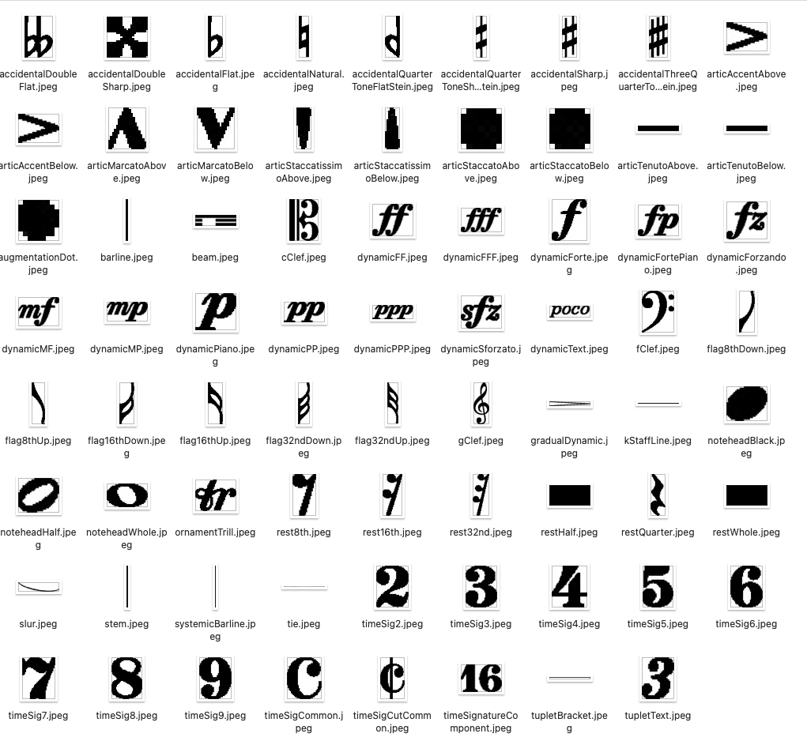

# DoReMi - Data Collection Lifecycle Document

This documents the lifecycle of the DOREMI dataset. DOReMi is a dataset that contains data related to OMR research. DOReMi is a product of collaborative work between [Steinberg's Dorico](https://new.steinberg.net/dorico/) team and QMUL (Elona Shatri and George Fazekas). This dataset aims to fill in the existing gaps in OMR research. It is part of a larger research question, whether deep learning can assist theOMR field.  What sets DOReMi aside from the other datasets is the richness of data. Given that this dataset is generated using Dorico (a music notation software from Steinberg), we had the chance to grab more musical information on it, but also different types of data. Using Dorico we can generate 5 types of data that could possibly be used in different steps of OMR. These data are images of scores (binary or colour), the musicXML file, XML files with metadata such as bounding boxes of each object together with musical information, which will be explained in detail later on, and as part of our dataset we can utilize the midi audio file which can be later used for transcription as well. 

Music used to generate this dataset comes from a software test set provided by the Dorico team. This test set includes a wider number of objects, classes and various cases of notations not normally seen in real-world music. About half of this dataset is copyright protected; therefore, we only include openly distributable scores in the final published dataset. However, pre-trained models trained in the whole dataset will also be published. DoReMi includes around 6432 images of sheet
music with nearly a million annotated objects which is 1 th 50 the size of DeepScores and 42 times the size of Muscima++. Each object on the page is annotated with category labels from 94 different classes. However, there is an emphasised class imbalance; stems and noteheads make up half of the annotated objects in the dataset. We also provide prepared subsets fulfilling different requirements on the number of pages, number of classes and the number of staves. Most of the images include one system per page; depending on the number of voices, they will have one or more staves per page. 

## [Discovery and Planning](#discovery-and-planning)

### [Data type and format](#Data-type-and-format)
*   [Dorico project](dorico-project)
*   [MusicXML](#MusicXML)
*   [OMR metadata](#OMR-metadata)
*   [Images of scores](#Images-of-scores)
*   [MIDI](#MIDI)
*   [Combining DOReMi with Muscima++ and Deepscores](#combining)

## [Initial Data Collection](#collection)
## [Data Preparation and analysis](#preparation)
## [Publication and Sharing](#publication)
## [Long-term Management](#managment)

<hr />
<hr />

##  <A id="discovery-and-planning"> Discovery and Planning </A>

In this section, I will explain the data types and formats we have decided to use.

### <A id="Data-type-and-format"> Data type and format </A>

This dataset has the following six types of data:

* [Dorico project](#dorico-project)
* [MusicXML](#MusicXML)
* [OMR metadata](#OMR-metadata)
* [Images of scores](#Images-of-scores)
* [MIDI](#MIDI) 
* [Music Encoding Initiative (MEI)](#MEI)

The following respective data formats:
*   Dorico
*   MusicXML
*   XML
*   PNG
*   MIDI
*   MEI

Let’s start by explaining each one of the data types and what they contain:

<A id="dorico-project"> Dorico project </A>

 

When saving the scores in Dorico, it uses the .dorico file format, which is the project type. Saving the projects is really important for the lifecycle since it allows us to use the same layout settings if we later want to generate other data or change.


<A id="MusicXML">  MusicXML </A> 

MusicXML is widely known and used data format in music notation which uses the XML file format. MusicXML allows interchangeability between different scorewriters. Dorico can export the projects to MusicXML. The extension for these files is .xml. 
More on how these files can be exported check <A href="https://steinberg.help/dorico_pro/v3/en/dorico/topics/project_file_handling/project_file_handling_musicxml_files_exporting_t.html"> here </A>
<br />
<br />

```xml
<?xml version="1.0" encoding="UTF-8" standalone="no"?>
<!DOCTYPE score-partwise PUBLIC "-//Recordare//DTD MusicXML 3.1 Partwise//EN" "http://www.musicxml.org/dtds/partwise.dtd">
<score-partwise version="3.1">
  <work>
    <work-title>beam groups 3</work-title>
  </work>
  <movement-title>beam groups 3</movement-title>
  <identification>
    <encoding>
      <software>Dorico 4.0.0.5342</software>
      <encoding-date>2021-06-14</encoding-date>
    </encoding>
  </identification>
  <part-list>
    <score-part id="P1">
      <part-name>P 1</part-name>
    </score-part>
  </part-list>
  <part id="P1">
    <measure number="1">
      <attributes>
        <divisions>12</divisions>
        <key number="1">
          <fifths>0</fifths>
          <mode>major</mode>
        </key>
        <time>

...

  </part>
</score-partwise>
```


<A id="OMR-metadata"> OMR metadata </A> 

Following the organisation of Muscima++, DoReMi has an OMR metadata file which includes bounding boxes of each element: top, left, width and height. It also includes the pixel mask for each element giving each object’s pixels inside the bounding box. 

In words, each file can have data on more than one page, if that is the case, an id is assigned to each page. Each page can have multiple nodes. Nodes are the individual elements or objects in the score, for instance, stem, staff lines, blackhead, whole note, augmentation dot and so on. Each object or node is assigned an id. This node will now have the bounding box information which includes top, left, width and height. The top is the distance from the top of the page to the point where the object starts (vertically). Left is the distance from the left of the page to the point where the object starts (horizontally). Height is the distance from top to where the object ends (vertically). Width is the distance from the left point to the rightest point where the object ends (horizontally). 


Additionally, DoReMi provides the relationships between primitives. It vaguely follows the Music Notation Graph (MUNG), which creates a graph representation of music notations. Inlinks and outlinks reference back and forth to the ID of the objects they are related to—for instance, a notehead half outlinks to a stem or a slur or both of them. Conversely, the stem inlinks to the notehead half.

OMR metadata are the files that incorporate most of the information needed for OMR practitces. These files include visual information, coordinates, bounding boxes, pixel information and furthermore musical information such as duration beats, onset beats, pitch octave, midi pitch note, normalized pitch step and the dorico event id depending on the class of the object. 

Depending on the task the dataset includes both parsed and unparsed XML files. If the dataset is to be used only for object detection or instance segmentation the parsed files are divided by page, corresponding to an image respective to the actual page. These files hold information on the bounding boxes and pixel mask information.


```xml
<?xml version="1.0" encoding="utf-8"?>
<Pages>
<Page pageIndex="0">
<Nodes>
<Node>
<Id>95</Id>
<ClassName>timeSig4</ClassName>
<Top>709</Top>
<Left>386</Left>
<Width>36</Width>
<Height>42</Height>
<Mask>0:11 1:16 0:20 1:16 0:20 1:15 0:21 1:15 0:21 1:14 0:22 1:13 0:22 1:14 0:22 1:13 0:3 1:3 0:17 1:12 0:3 1:4 0:17 1:11 0:3 1:5 0:16 1:12 0:2 1:6 0:16 1:11 0:3 1:6 0:15 1:11 0:3 1:7 0:15 1:10 0:3 1:8 0:15 1:10 0:2 1:9 0:14 1:10 0:2 1:10 0:14 1:9 0:2 1:11 0:13 1:9 0:3 1:11 0:12 1:10 0:2 1:12 0:12 1:9 0:3 1:12 0:11 1:9 0:4 1:12 0:11 1:8 0:5 1:12 0:10 1:8 0:6 1:12 0:9 1:8 0:7 1:12 0:9 1:7 0:8 1:12 0:8 1:7 0:9 1:12 0:7 1:7 0:10 1:12 0:7 1:144 0:17 1:12 0:24 1:12 0:24 1:12 0:24 1:12 0:24 1:12 0:23 1:13 0:22 1:15 0:18 1:21 0:14 1:22 0:14 1:22 0:15 1:21 0:3 </Mask>
<Data>
<DataItem key="dorico_event_id" type="int">904</DataItem>
<DataItem key="time_signature_description" type="str">2/4 (q, 1+1)</DataItem>
<DataItem key="staff_id" type="int">0</DataItem>
</Data>
</Node>
<Node>
<Id>94</Id>
<ClassName>timeSig2</ClassName>
<Top>666</Top>
<Left>387</Left>
<Width>34</Width>
<Height>43</Height>
<Mask>0:9 1:15 0:16 1:21 0:11 1:25 0:8 1:7 0:8 1:12 0:6 1:7 0:10 1:12 0:4 1:7 0:12 1:12 0:3 1:9 0:11 1:12 0:1 1:12 0:9 1:12 0:1 1:13 0:8 1:26 0:8 1:27 0:7 1:27 0:7 1:27 0:7 1:27 0:7 1:27 0:6 1:27 0:7 1:14 0:1 1:12 0:6 1:15 0:2 1:11 0:6 1:14 0:4 1:9 0:6 1:15 0:6 1:5 0:8 1:14 0:19 1:14 0:19 1:14 0:19 1:13 0:20 1:11 0:21 1:10 0:23 1:8 0:24 1:8 0:25 1:7 0:16 1:3 0:7 1:7 0:17 1:3 0:5 1:16 0:9 1:4 0:5 1:19 0:6 1:4 0:4 1:23 0:2 1:5 0:3 1:30 0:3 1:31 0:3 1:31 0:2 1:31 0:3 1:31 0:2 1:32 0:2 1:8 0:4 1:19 0:3 1:7 0:6 1:17 0:4 1:6 0:9 1:14 0:5 1:5 0:12 1:11 0:7 1:3 0:18 1:1 0:11 </Mask>
<Data>
<DataItem key="dorico_event_id" type="int">904</DataItem>
<DataItem key="time_signature_description" type="str">2/4 (q, 1+1)</DataItem>
<DataItem key="staff_id" type="int">0</DataItem>
</Data>
...
</Nodes>
</Page>
</Pages>
```

 Certain (playable) objects are also annotated with a Dorico event ID which is a unique event identifier that provides additional information on how some objects are linked. For instance, notes like noteheads have information on the duration beats, onset beats, pitch octave, midi pitch code, normalised pitch step and an event ID. 
<br />
<br />

```xml
<Node>
<Id>504</Id>
<ClassName>noteheadBlack</ClassName>
<Top>466</Top>
<Left>2236</Left>
<Width>28</Width>
<Height>24</Height>
<Mask>0:12 1:11 0:14 1:16 0:10 1:19 0:8 1:21 0:6 1:22 0:5 1:24 0:3 1:25 0:2 1:26 0:1 1:27 0:1 1:27 0:1 1:54 0:1 1:27 0:1 1:26 0:2 1:26 0:2 1:25 0:3 1:24 0:4 1:23 0:5 1:22 0:6 1:21 0:8 1:19 0:10 1:16 0:13 1:13 0:18 1:6 0:16 </Mask>
<Outlinks>541 559 571</Outlinks>
<Data>
<DataItem key="duration_beats" type="float">0.333333</DataItem>
<DataItem key="onset_beats" type="float">47.666668</DataItem>
<DataItem key="pitch_octave" type="int">4</DataItem>
<DataItem key="midi_pitch_code" type="int">69</DataItem>
<DataItem key="normalized_pitch_step" type="str">A</DataItem>
<DataItem key="dorico_event_id" type="int">1120</DataItem>
<DataItem key="staff_id" type="int">0</DataItem>
</Data>
</Node>
```


 
 For elements such as clefs, our dataset provides an event ID, clef type, clef hotspot, clef required stave lines and clef stave position. Clef hotspot identifies the midi pitch that clef denotes, i.e. for treble clef is G4, as that is the pitch of the second stave line from the bottom. Clef required stave lines shows how many stave lines the clef needs.

```xml
<Node>
<Id>93</Id>
<ClassName>gClef</ClassName>
<Top>638</Top>
<Left>309</Left>
<Width>56</Width>
<Height>147</Height>
<Mask>0:35 1:5 0:50 1:7 0:48 1:9 0:46 1:11 0:44 1:12 0:44 1:13 0:42 1:14 0:41 1:16 0:40 1:16 0:39 1:18 0:38 1:18 0:37 1:19 0:37 1:20 0:35 1:21 0:35 1:10 0:6 1:5 0:35 1:9 0:7 1:5 0:34 1:9 0:9 1:5 0:33 1:8 0:10 1:5 0:33 1:8 0:11 1:4 0:33 1:7 0:12 1:4 0:33 1:6 0:13 1:4 0:32 1:7 0:12 1:5 0:32 1:7 0:12 1:5 0:32 1:6 0:13 1:5 0:32 1:6 0:13 1:5 0:32 1:6 0:12 1:6 0:32 1:5 0:13 1:6 0:32 1:5 0:13 1:6 0:32 1:5 0:12 1:7 0:32 1:5 0:11 1:8 0:32 1:5 0:11 1:7 0:33 1:5 0:10 1:8 0:33 1:5 0:9 1:9 0:33 1:5 0:8 1:10 0:33 1:5 0:8 1:9 0:34 1:5 0:7 1:10 0:34 1:5 0:6 1:11 0:34 1:5 0:5 1:11 0:35 1:5 0:4 1:12 0:35 1:5 0:3 1:13 0:36 1:4 0:2 1:13 0:37 1:4 0:1 1:14 0:37 1:18 0:38 1:17 0:39 1:17 0:38 1:17 0:38 1:17 0:38 1:18 0:36 1:19 0:36 1:19 0:36 1:19 0:36 1:19 0:36 1:20 0:35 1:20 0:35 1:20 0:35 1:20 0:35 1:20 0:35 1:21 0:34 1:22 0:33 1:18 0:1 1:4 0:33 1:17 0:2 1:4 0:32 1:17 0:3 1:5 0:30 1:17 0:4 1:5 0:29 1:16 0:7 1:4 0:29 1:15 0:8 1:4 0:28 1:15 0:9 1:4 0:27 1:15 0:10 1:5 0:26 1:14 0:11 1:5 0:25 1:14 0:12 1:5 0:25 1:13 0:14 1:4 0:24 1:13 0:15 1:11 0:17 1:12 0:14 1:16 0:14 1:12 0:11 1:21 0:11 1:12 0:11 1:24 0:9 1:11 0:11 1:26 0:8 1:10 0:10 1:29 0:6 1:11 0:10 1:30 0:5 1:10 0:10 1:32 0:4 1:10 0:9 1:34 0:3 1:9 0:9 1:35 0:3 1:9 0:9 1:36 0:2 1:8 0:9 1:37 0:2 1:8 0:9 1:19 0:2 1:17 0:1 1:8 0:9 1:12 0:3 1:4 0:5 1:14 0:1 1:8 0:9 1:10 0:5 1:5 0:6 1:21 0:8 1:10 0:6 1:5 0:7 1:19 0:9 1:9 0:7 1:5 0:8 1:18 0:9 1:8 0:9 1:4 0:9 1:17 0:9 1:8 0:9 1:4 0:10 1:16 0:9 1:7 0:10 1:5 0:9 1:16 0:9 1:7 0:10 1:5 0:10 1:15 0:10 1:6 0:10 1:5 0:10 1:8 0:1 1:6 0:10 1:6 0:10 1:5 0:10 1:8 0:1 1:7 0:9 1:6 0:11 1:4 0:10 1:8 0:1 1:7 0:9 1:6 0:11 1:4 0:10 1:8 0:2 1:6 0:10 1:6 0:10 1:5 0:10 1:7 0:2 1:7 0:9 1:6 0:10 1:5 0:10 1:7 0:2 1:7 0:10 1:6 0:9 1:5 0:9 1:7 0:4 1:7 0:10 1:6 0:8 1:5 0:9 1:7 0:4 1:7 0:10 1:7 0:8 1:4 0:9 1:7 0:5 1:7 0:10 1:8 0:6 1:4 0:8 1:7 0:7 1:7 0:11 1:7 0:5 1:5 0:7 1:7 0:8 1:7 0:12 1:5 0:5 1:5 0:6 1:7 0:9 1:8 0:14 1:1 0:6 1:5 0:5 1:7 0:11 1:8 0:20 1:5 0:4 1:7 0:13 1:9 0:19 1:4 0:3 1:8 0:15 1:9 0:17 1:4 0:1 1:8 0:18 1:10 0:15 1:12 0:20 1:13 0:10 1:12 0:23 1:31 0:27 1:27 0:32 1:22 0:39 1:12 0:1 1:4 0:52 1:5 0:51 1:5 0:51 1:5 0:51 1:5 0:52 1:4 0:52 1:5 0:51 1:5 0:51 1:5 0:51 1:5 0:51 1:5 0:29 1:8 0:15 1:4 0:27 1:11 0:14 1:4 0:26 1:13 0:13 1:5 0:24 1:15 0:12 1:5 0:24 1:16 0:11 1:5 0:23 1:17 0:11 1:5 0:23 1:17 0:11 1:5 0:23 1:17 0:11 1:5 0:23 1:17 0:11 1:5 0:23 1:17 0:11 1:5 0:23 1:17 0:11 1:4 0:24 1:17 0:10 1:5 0:24 1:17 0:10 1:5 0:24 1:16 0:11 1:5 0:24 1:16 0:10 1:5 0:26 1:13 0:11 1:6 0:26 1:12 0:12 1:5 0:28 1:8 0:13 1:7 0:28 1:8 0:12 1:7 0:30 1:9 0:7 1:9 0:32 1:23 0:35 1:19 0:39 1:15 0:45 1:8 0:25 </Mask>
<Data>
<DataItem key="dorico_event_id" type="int">908</DataItem>
<DataItem key="clef_type" type="str">kGClef</DataItem>
<DataItem key="clef_hotspot" type="str">G4</DataItem>
<DataItem key="clef_required_stave_lines" type="int">5</DataItem>
<DataItem key="clef_stave_position" type="int">2</DataItem>
<DataItem key="staff_id" type="int">0</DataItem>
</Data>
</Node>
```

 
 Time signatures will include the event ID, time signature description, for example, 3/2 (h, 1+1+1).
<br />
```xml
<Node>
    <Id>511</Id>
    <ClassName>timeSig4</ClassName>
    <Top>467</Top>
    <Left>828</Left>
    <Width>36</Width>   
    <Height>42</Height>
    <Mask>0:11 1:16 0:20 1:16 0:20 1:15 
    ...
    0:21 1:15 0:21 1:14 0:22 1:13 0:22 
    <Data>
        <DataItem key="dorico_event_id" type="int">-1</DataItem>
        <DataItem key="time_signature_description" type="str"/>
    </Data>
</Node>
```


 Flags, if they are part of grace notes, will have a boolean value set to True. Slurs and ties have their event IDs, while barlines, rests, accidentals, augmentation dots, stems do not have such information. Beams will not have their event ID; instead, they will have a list of the event IDs their respective noteheads have. 

```xml
<Node>
<Id>69</Id>
<ClassName>kStaffLine</ClassName>
<Top>666</Top>
<Left>299</Left>
<Width>2001</Width>
<Height>3</Height>
<Mask>0:0 1:6003 </Mask>
<Data>
<DataItem key="staff_id" type="int">0</DataItem>
</Data>
</Node>
```


A detailed **table of what each objet includes for musical features** is shown below. Scroll right for all attributes.


<div class="table-wrapper" markdown="block">

| Class                                     | Frequency | dorico_event_id | clef_type | clef_hotspot | lef_required_stave_lines | clef_stave_position | staff_id | dorico_event_ids | grace_note | duration_beats | onset_beats | pitch_octave | midi_pitch_code | normalized_pitch_step | time_signature_description | text |
|-------------------------------------------|-----------|-----------------|-----------|--------------|--------------------------|---------------------|----------|------------------|------------|----------------|-------------|--------------|-----------------|-----------------------|----------------------------|------|
| accidentalDoubleFlat                      | 244       |                 |           |              |                          |                     | x        |                  |            |                |             |              |                 |                       |                            |      |
| accidentalDoubleSharp                     | 330       |                 |           |              |                          |                     | x        |                  |            |                |             |              |                 |                       |                            |      |
| accidentalFlat                            | 12705     |                 |           |              |                          |                     | x        |                  |            |                |             |              |                 |                       |                            |      |
| accidentalKomaFlat                        | 5         |                 |           |              |                          |                     | x        |                  |            |                |             |              |                 |                       |                            |      |
| accidentalKomaSharp                       | 5         |                 |           |              |                          |                     | x        |                  |            |                |             |              |                 |                       |                            |      |
| accidentalNatural                         | 11137     |                 |           |              |                          |                     | x        |                  |            |                |             |              |                 |                       |                            |      |
| accidentalQuarterToneFlatStein            | 162       |                 |           |              |                          |                     | x        |                  |            |                |             |              |                 |                       |                            |      |
| accidentalQuarterToneSharpStein           | 191       |                 |           |              |                          |                     | x        |                  |            |                |             |              |                 |                       |                            |      |
| accidentalSharp                           | 12908     |                 |           |              |                          |                     | x        |                  |            |                |             |              |                 |                       |                            |      |
| accidentalThreeQuarterTonesFlatZimmermann | 1         |                 |           |              |                          |                     | x        |                  |            |                |             |              |                 |                       |                            |      |
| accidentalThreeQuarterTonesSharpStein     | 27        |                 |           |              |                          |                     | x        |                  |            |                |             |              |                 |                       |                            |      |
| accidentalTripleFlat                      | 1         |                 |           |              |                          |                     | x        |                  |            |                |             |              |                 |                       |                            |      |
| accidentalTripleSharp                     | 1         |                 |           |              |                          |                     | x        |                  |            |                |             |              |                 |                       |                            |      |
| articAccentAbove                          | 1477      |                 |           |              |                          |                     | x        |                  |            |                |             |              |                 |                       |                            |      |
| articAccentBelow                          | 1916      |                 |           |              |                          |                     | x        |                  |            |                |             |              |                 |                       |                            |      |
| articMarcatoAbove                         | 278       |                 |           |              |                          |                     | x        |                  |            |                |             |              |                 |                       |                            |      |
| articMarcatoBelow                         | 34        |                 |           |              |                          |                     | x        |                  |            |                |             |              |                 |                       |                            |      |
| articStaccatissimoAbove                   | 536       |                 |           |              |                          |                     | x        |                  |            |                |             |              |                 |                       |                            |      |
| articStaccatissimoBelow                   | 414       |                 |           |              |                          |                     | x        |                  |            |                |             |              |                 |                       |                            |      |
| articStaccatoAbove                        | 5018      |                 |           |              |                          |                     | x        |                  |            |                |             |              |                 |                       |                            |      |
| articStaccatoBelow                        | 6108      |                 |           |              |                          |                     | x        |                  |            |                |             |              |                 |                       |                            |      |
| articTenutoAbove                          | 823       |                 |           |              |                          |                     | x        |                  |            |                |             |              |                 |                       |                            |      |
| articTenutoBelow                          | 735       |                 |           |              |                          |                     | x        |                  |            |                |             |              |                 |                       |                            |      |
| augmentationDot                           | 2762      |                 |           |              |                          |                     |          |                  |            |                |             |              |                 |                       |                            |      |
| barline                                   | 28142     |                 |           |              |                          |                     |          |                  |            |                |             |              |                 |                       |                            |      |
| beam                                      | 52539     |                 |           |              |                          |                     | x        | x                |            |                |             |              |                 |                       |                            |      |
| cClef                                     | 1161      | x               | x         | x            | x                        | x                   | x        |                  |            |                |             |              |                 |                       |                            |      |
| dynamicFF                                 | 242       |                 |           |              |                          |                     | x        |                  |            |                |             |              |                 |                       |                            |      |
| dynamicFFF                                | 88        |                 |           |              |                          |                     | x        |                  |            |                |             |              |                 |                       |                            |      |
| dynamicFFFF                               | 4         |                 |           |              |                          |                     | x        |                  |            |                |             |              |                 |                       |                            |      |
| dynamicForte                              | 777       |                 |           |              |                          |                     | x        |                  |            |                |             |              |                 |                       |                            |      |
| dynamicFortePiano                         | 60        |                 |           |              |                          |                     | x        |                  |            |                |             |              |                 |                       |                            |      |
| dynamicForzando                           | 35        |                 |           |              |                          |                     | x        |                  |            |                |             |              |                 |                       |                            |      |
| dynamicMF                                 | 1803      |                 |           |              |                          |                     | x        |                  |            |                |             |              |                 |                       |                            |      |
| dynamicMP                                 | 185       |                 |           |              |                          |                     | x        |                  |            |                |             |              |                 |                       |                            |      |
| dynamicPiano                              | 3987      |                 |           |              |                          |                     | x        |                  |            |                |             |              |                 |                       |                            |      |
| dynamicPP                                 | 1807      |                 |           |              |                          |                     | x        |                  |            |                |             |              |                 |                       |                            |      |
| dynamicPPP                                | 93        |                 |           |              |                          |                     | x        |                  |            |                |             |              |                 |                       |                            |      |
| dynamicPPPP                               | 13        |                 |           |              |                          |                     | x        |                  |            |                |             |              |                 |                       |                            |      |
| dynamicRinforzando2                       | 5         |                 |           |              |                          |                     | x        |                  |            |                |             |              |                 |                       |                            |      |
| dynamicSforzato                           | 236       |                 |           |              |                          |                     | x        |                  |            |                |             |              |                 |                       |                            |      |
| dynamicSforzatoFF                         | 6         |                 |           |              |                          |                     | x        |                  |            |                |             |              |                 |                       |                            |      |
| dynamicText                               | 110       |                 |           |              |                          |                     | x        |                  |            |                |             |              |                 |                       |                            | x    |
| fClef                                     | 3543      | x               | x         | x            | x                        | x                   | x        |                  |            |                |             |              |                 |                       |                            |      |
| flag16thDown                              | 430       |                 |           |              |                          |                     | x        |                  | x          |                |             |              |                 |                       |                            |      |
| flag16thUp                                | 18245     |                 |           |              |                          |                     | x        |                  | x          |                |             |              |                 |                       |                            |      |
| flag32ndDown                              | 31        |                 |           |              |                          |                     | x        |                  | x          |                |             |              |                 |                       |                            |      |
| flag32ndUp                                | 7264      |                 |           |              |                          |                     | x        |                  | x          |                |             |              |                 |                       |                            |      |
| flag64thUp                                | 10        |                 |           |              |                          |                     | x        |                  | x          |                |             |              |                 |                       |                            |      |
| flag8thDown                               | 3672      |                 |           |              |                          |                     | x        |                  | x          |                |             |              |                 |                       |                            |      |
| flag8thUp                                 | 8113      |                 |           |              |                          |                     | x        |                  | x          |                |             |              |                 |                       |                            |      |
| gClef                                     | 12278     | x               | x         | x            | x                        | x                   | x        |                  |            |                |             |              |                 |                       |                            |      |
| gradualDynamic                            | 7084      |                 |           |              |                          |                     | x        |                  |            |                |             |              |                 |                       |                            |      |
| kStaffLine                                | 160426    |                 |           |              |                          |                     | x        |                  |            |                |             |              |                 |                       |                            |      |
| mensuralNoteheadMinimaWhite               | 9         | x               |           |              |                          |                     | x        |                  |            | x              | x           | x            | x               | x                     |                            |      |
| noteheadBlack                             | 247741    | x               |           |              |                          |                     | x        |                  | x          | x              | x           | x            | x               | x                     |                            |      |
| noteheadDiamondWhole                      | 8         | x               |           |              |                          |                     | x        |                  |            | x              | x           | x            | x               | x                     |                            |      |
| noteheadDoubleWholeSquare                 | 3         | x               |           |              |                          |                     | x        |                  |            | x              | x           | x            | x               | x                     |                            |      |
| noteheadHalf                              | 8648      | x               |           |              |                          |                     | x        |                  |            | x              | x           | x            | x               | x                     |                            |      |
| noteheadTriangleUpBlack                   | 27        | x               |           |              |                          |                     | x        |                  |            | x              | x           | x            | x               | x                     |                            |      |
| noteheadTriangleUpHalf                    | 3         | x               |           |              |                          |                     | x        |                  |            | x              | x           | x            | x               | x                     |                            |      |
| noteheadWhole                             | 1502      | x               |           |              |                          |                     | x        |                  |            | x              | x           | x            | x               | x                     |                            |      |
| noteheadXBlack                            | 81        | x               |           |              |                          |                     | x        |                  |            | x              | x           | x            | x               | x                     |                            |      |
| ornamentMordent                           | 7         | x               |           |              |                          |                     | x        |                  |            |                |             |              |                 |                       |                            |      |
| ornamentTrill                             | 58        | x               |           |              |                          |                     | x        |                  |            |                |             |              |                 |                       |                            |      |
| ornamentTurn                              | 6         | x               |           |              |                          |                     | x        |                  |            |                |             |              |                 |                       |                            |      |
| rest                                      | 4         |                 |           |              |                          |                     |          |                  |            |                |             |              |                 |                       |                            |      |
| rest16th                                  | 29411     |                 |           |              |                          |                     |          |                  |            |                |             |              |                 |                       |                            |      |
| rest32nd                                  | 10218     |                 |           |              |                          |                     |          |                  |            |                |             |              |                 |                       |                            |      |
| rest64th                                  | 4         |                 |           |              |                          |                     |          |                  |            |                |             |              |                 |                       |                            |      |
| rest8th                                   | 24124     |                 |           |              |                          |                     |          |                  |            |                |             |              |                 |                       |                            |      |
| restHalf                                  | 1376      |                 |           |              |                          |                     |          |                  |            |                |             |              |                 |                       |                            |      |
| restQuarter                               | 13223     |                 |           |              |                          |                     |          |                  |            |                |             |              |                 |                       |                            |      |
| restWhole                                 | 14382     |                 |           |              |                          |                     |          |                  |            |                |             |              |                 |                       |                            |      |
| slur                                      | 13928     | x               |           |              |                          |                     | x        |                  |            |                |             |              |                 |                       |                            |      |
| stem                                      | 227889    |                 |           |              |                          |                     | x        |                  |            |                |             |              |                 |                       |                            |      |
| systemicBarline                           | 2078      |                 |           |              |                          |                     |          |                  |            |                |             |              |                 |                       |                            |      |
| tie                                       | 8626      | x               |           |              |                          |                     | x        |                  |            |                |             |              |                 |                       |                            |      |
| timeSig1                                  | 2         | x               |           |              |                          |                     | x        |                  |            |                |             |              |                 |                       | x                          |      |
| timeSig2                                  | 1084      | x               |           |              |                          |                     | x        |                  |            |                |             |              |                 |                       | x                          |      |
| timeSig3                                  | 1203      | x               |           |              |                          |                     | x        |                  |            |                |             |              |                 |                       | x                          |      |
| timeSig4                                  | 2674      | x               |           |              |                          |                     | x        |                  |            |                |             |              |                 |                       | x                          |      |
| timeSig5                                  | 507       | x               |           |              |                          |                     | x        |                  |            |                |             |              |                 |                       | x                          |      |
| timeSig6                                  | 246       | x               |           |              |                          |                     | x        |                  |            |                |             |              |                 |                       | x                          |      |
| timeSig7                                  | 125       | x               |           |              |                          |                     | x        |                  |            |                |             |              |                 |                       | x                          |      |
| timeSig8                                  | 1661      | x               |           |              |                          |                     | x        |                  |            |                |             |              |                 |                       | x                          |      |
| timeSig9                                  | 79        | x               |           |              |                          |                     | x        |                  |            |                |             |              |                 |                       | x                          |      |
| timeSigCommon                             | 206       | x               |           |              |                          |                     | x        |                  |            |                |             |              |                 |                       | x                          |      |
| timeSigCutCommon                          | 113       | x               |           |              |                          |                     | x        |                  |            |                |             |              |                 |                       | x                          |      |
| timeSignatureComponent                    | 443       | x               |           |              |                          |                     | x        |                  |            |                |             |              |                 |                       | x                          |      |
| tupletBracket                             | 4970      | x               |           |              |                          |                     | x        |                  |            |                |             |              |                 |                       |                            |      |
| tupletText                                | 4900      | x               |           |              |                          |                     | x        |                  |            |                |             |              |                 |                       |                            | x    |
| unpitchedPercussionClef1                  | 223       | x               | x         | x            | x                        | x                   | x        |                  |            |                |             |              |                 |                       |                            |      |
| wiggleTrill                               | 45        | x               |           |              |                          |                     | x        |                  |            |                |             |              |                 |                       |                            |      |
|                                           |           |                 |           |              |                          |                     |          |                  |            |                |             |              |                 |                       |                            |      |

</div>


<A id="Images-of-scores"> Images of scores </A> 

Given that each project can have one or more pages, we use the mono png export from Dorico at 300 DPI. Each image is named after the OMR metadata xml file, with the number suffix, starting 001. Images are of dimension 2475 × 3504 pixels and are binarised. An example of an image is given below. All these images are binarised and ready to use. 


<A id="MIDI"> MIDI </A> 

MIDI (Musical Instrument Digital Interface) standard file provides a standardized file format way for music sequences to be saved, transported, and opened in other systems. They are characterised by their compact size which led to their widespread use in computers. They are intended for universal use and have information such as note values, timing and track name. We want to include such files in our dataset since MIDI is one of the end file formats retrieved from some OMR architecture. We believe that it is essential to include such files that could later on may be used for multi-modal learning in OMR as well.


<A id="MEI"> Music Encoding Initiative (MEI) </A>

Except for MusicXML for we go one step further to also providing its respective [Music Encoding Initiative (MEI)](https://music-encoding.org/) files. The model underlying MEI recognizes four distinct aspects of music notation: logical; gestural; visual; and analytical. The logical domain includes the musical content or structure including pitches, time values, articulations, dynamics, and all other elements—defined as the symbols that communicate the composer’s intentions. The gestural domain relates to a performed interpretation of the logical domain (i.e., it encodes information that may be added by a performer such as explicit realizations of "swing" or rubato). The visual domain describes the contributions of an editor, engraver, or typesetter, and encodes information about the physical appearance of the score, such as symbol locations, page layout, or font. Finally, the analytical domain covers commentary and analysis of the music document in any of the three previous domains. 

```xml
<?xml version="1.0" encoding="UTF-8"?>
<?xml-model href="https://music-encoding.org/schema/4.0.0/mei-all.rng" type="application/xml" schematypens="http://relaxng.org/ns/structure/1.0"?>
<?xml-model href="https://music-encoding.org/schema/4.0.0/mei-all.rng" type="application/xml" schematypens="http://purl.oclc.org/dsdl/schematron"?>
<mei xmlns="http://www.music-encoding.org/ns/mei" meiversion="4.0.0">
   <meiHead>
      <fileDesc>
         <titleStmt>
            <title>beam groups 3</title>
            <respStmt />
         </titleStmt>
         <pubStmt><date isodate="2021-06-14" type="encoding-date">2021-06-14</date>
         </pubStmt>
      </fileDesc>
      <encodingDesc xml:id="encodingdesc-0000001420266469">
         <appInfo xml:id="appinfo-0000001827384277">
            <application xml:id="application-0000000862295293" isodate="2021-06-14T15:00:01" version="3.5.0-dev-118873d">
               <name xml:id="name-0000002103025164">Verovio</name>
               <p xml:id="p-0000001992846044">Transcoded from MusicXML</p>
            </application>
         </appInfo>
      </encodingDesc>
   </meiHead>
   <music>
      <body>
         <mdiv xml:id="mdiv-0000001025466895">
            <score xml:id="score-0000001308189520">
               <scoreDef xml:id="scoredef-0000000993314183">
                  <staffGrp xml:id="staffgrp-0000000471437396">
                     <staffDef xml:id="P1" n="1" lines="5" ppq="12">
                        <label xml:id="label-0000000781857015">P 1</label>
                        <clef xml:id="clef-0000000149139464" shape="G" line="2" />
                        <keySig xml:id="keysig-0000000931258970" mode="major" sig="0" />
                        <meterSig xml:id="msig-0000002113427645" count="2" unit="4" />
                     </staffDef>
                  </staffGrp>
               </scoreDef>
...
      </body>
   </music>
</mei>
```


## <A id="combining"> Combining DOReMi with Muscima++ and Deepscores </A>

Recently, researchers have been working on bringing their datasets together, namely Muscima++ [4] and DeepScores [9], to improve compatibility. Muscima++ contains handwritten music, while DeepScores is a typeset music dataset, both of which can be used in object detection. Harmonising them aids the goal of creating a reference dataset. With the motivation to support this goal and compare and use these datasets in future experiments, DoReMi is easily harmonised with Muscima++ and DeepScores.

## <A id="collection"> Initial Data Collection </A>

The dataset is derived from scores originally used for testing music notation software. This includes real-world scores in addition to synthetic scores built to test particular engraving use cases. 

The process of creating DoReMI using Dorico starts by creating a meta-picture of a single glyph or drawable primitive (slurs, lines, musical symbols) to allow generation of bounding boxes and pixel masks at the origin of the coordinate system y-down \footnote{The origin is in the top-left where the x-axis extends to the right and the y-axis extends downwards}. Rendering them at the origin ensures minimisation of the variations introduced by anti-aliasing artefacts. The vector-based glyph or primitive is then rasterised to a monochrome pixel-based image. Sub-pixel positions might introduce some variations and shifts in the bounding boxes that are relocated to the original drawn positions. However, bounding boxes are accurate enough for all the objects, except for some shift in the staff lines. During rasterisation, some staff lines become thicker than the others, sometimes falling out of the bounding box. Such inconsistencies are easily optically noticed given the even spaced nature of staff lines and can be minimised at the cost of increasing the resolution (DPI). Finally, the images are exported as PNGs. 

Dorico has a sophisticated internal representation and engraving engine for musical data at the drawing stage for efficiency. This results in significant challenges in reconnecting the primitives ultimately drawn to their original semantic sources. The addition of higher-level music attributes retrieved from Dorico to the metadata allows for the future use in the music reconstruction stage.
It is anticipated that we would iterate through the generation process by adding new features that would benefit the recognition score. On a practical level, we made a minor modification to allow for the logical grouping of pages into a single XML file. During data preprocessing, XML files were then separated by page (image).


## <A id="preparation"> Data Preparation and analysis </A>

The number of classes in the dataset is 94 as shown in the image below. 



## <A id="publication"> Publication and Sharing </A>

The dataset including only copy right free scores is already published in [this github release](https://github.com/steinbergmedia/DoReMi/releases/tag/v1.0). 

## <A id="managment"> Long-term Management </A>


